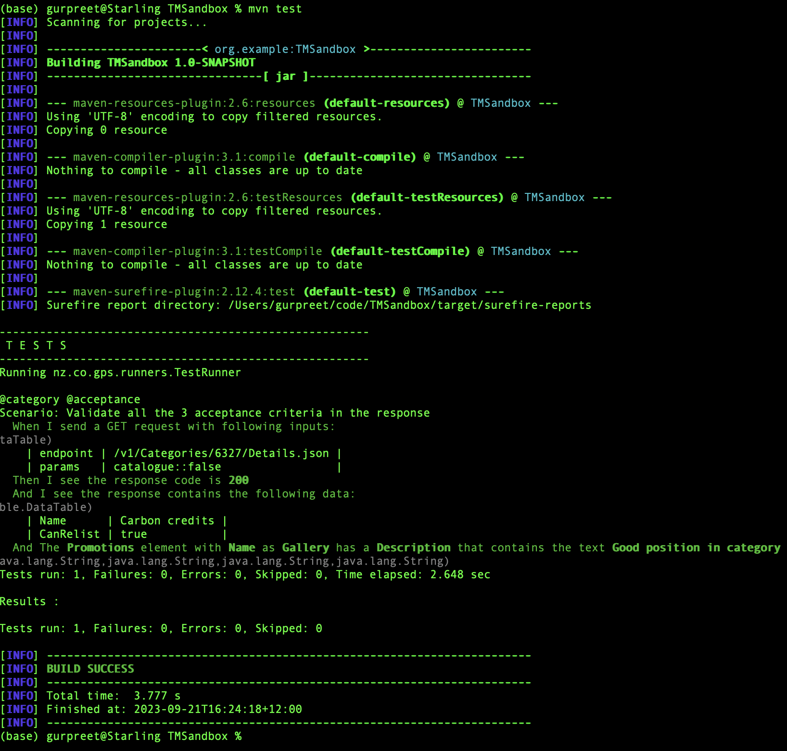
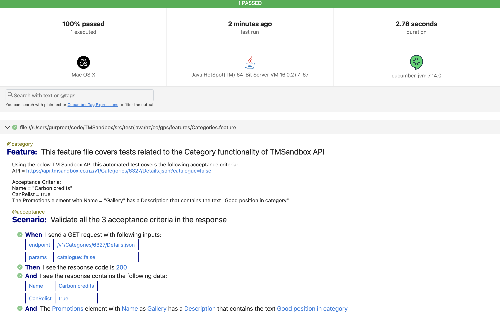

# TM Sandbox API Testing Project with Cucumber, Java, RestAssured, and JUnit

This is a TM Sandbox API testing project that leverages Behaviour-Driven Development (BDD) principles using Cucumber, Java, RestAssured, and JUnit. It allows you to create and execute automated tests for RESTful APIs while generating comprehensive Cucumber reports for test results.

## Project Overview

This project covers a test case that tests the Category endpoint and validates various aspects of the HTTP response from a GET request call. The project also helps illustrate how to set up a Maven-based Java project for API testing. It combines the following technologies and tools:

- **Cucumber:** A BDD framework that enables you to write human-readable scenarios in Gherkin syntax.
- **Java:** The programming language used for implementing step definitions and test logic.
- **RestAssured:** A popular Java library for simplifying API testing.
- **JUnit:** A testing framework for running and managing test cases.
- **Cucumber BDD Framework:** Used for writing test cases in English-like statements in Gherkin language and enables to passing of input data as the expected data from the feature files. Cucumber also generates detailed HTML reports for test results, making it easy to analyse and share test outcomes.

## Project Structure

The project structure is organized as follows:

```
TMSandbox-API/
├── src/
│   ├── main/
│   │   └── java
│   │       └── ... (framework code)
│   ├── test/
│   │   ├── java/nz.co.gps/
│   │   │   ├── features/
│   │   │   │   └── ... (Cucumber feature files)
│   │   │   ├── steps/
│   │   │   │   └── ... (Cucumber step definitions)
│   │   │   └── runners/
│   │   │       └── TestRunner.java (Cucumber test runner)
│   │   └── resources/
│   │       └── ... (Config files)
├── pom.xml (Maven project configuration)
└── README.md (This file)
```

## Prerequisites

Before you start using this project, ensure you have the following prerequisites installed on your machine:

- Java Development Kit (JDK)
- Apache Maven
- Integrated Development Environment (IDE) of your choice (e.g., IntelliJ IDEA, Eclipse)
- Git (for version control)

## Setup

To set up and run this project, follow these steps:

1. Clone this repository to your local machine:

```bash
   git clone https://github.com/gurpreetskairon/TMSandbox-API.git
```

2. Open the project in your preferred IDE. I have used IntelliJ Idea.
3. Build the project and resolve dependencies using Maven.

## Running Tests

To execute the Cucumber BDD tests:

- run the `TestRunner` class located in the `src/test/java/nz/co/gps/runners` directory. You can right-click on the `TestRunner` class and select "Run" in your IDE.
- run the test from the 'feature' file by right-clicking on the test and select "Run" in your IDE
- or run it using the following Maven command on terminal:

```bash
mvn test
```



The tests are by default run on the 'sandbox' environment. In case you have the API links to the 'test' or 'prod' environments, then edit the URL in the "global.properties" file located in `src/test/java/resources' directory, and pass the environment value in the Maven command using the "-Denv" option.

```bash
mvn test -Denv=prod
```

In order to Maven run a test using a tag, you could use the "-Dcucumber.filter.tags" option. For example, in order to run all the tests marked with '@acceptance' tag in the feature file, run the following command on the terminal.

```bash
mvn test -Dcucumber.filter.tags="@acceptance"
 
```

## Generating Cucumber Reports

This project includes Cucumber Reporting, which generates HTML reports for your test results. After running the tests, you can find the generated reports in the `target/cucumber-reports` directory. Open the `cucumber.html` file in a web browser to view the test execution report. Here is a report that was generated on running the acceptance test.



## Dependencies

This project relies on the following main dependencies, which are managed via Maven:

- Cucumber: A BDD framework for writing and executing feature files.
- JUnit: A popular testing framework for running unit tests.
- RestAssured: A library for testing RESTful APIs.

Refer to the `pom.xml` file for a complete list of dependencies.

## Additional Resources

- [Cucumber Documentation](https://cucumber.io/docs/cucumber/)
- [JUnit Documentation](https://junit.org/junit5/docs/current/user-guide/)
- [RestAssured Documentation](https://rest-assured.io/)
- [Maven Documentation](https://maven.apache.org/guides/getting-started/maven-in-five-minutes.html)
- [Maven Commands Cheat Sheet](https://www.digitalocean.com/community/tutorials/maven-commands-options-cheat-sheet)
